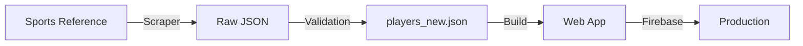

# BallKnower - Sports Knowledge Game

> Connect NBA and NFL players through teams, numbers, and colleges

## Repository Structure

This monorepo contains two main components:

### 🎮 `/ballknower` - Web Application
The main React application for playing BallKnower.

**Tech Stack:**
- React 19 + React Router
- Firebase (Firestore, Auth, Analytics, Hosting)
- Tailwind CSS
- Chart.js for statistics

**Quick Start:**
```bash
cd ballknower
npm install
cp .env.example .env
# Edit .env with your Firebase credentials
npm start
```

See `ballknower/README.md` for complete documentation.

### 🕷️ `/scraper` - Data Collection Pipeline
Python scripts for scraping and maintaining the player database from Sports Reference websites.

**Features:**
- Automated data collection from Basketball-Reference and Pro-Football-Reference
- Rate-limited requests (20 req/min) to respect ToS
- Incremental updates and data validation
- College name normalization

**Quick Start:**
```bash
cd scraper
pip install requests beautifulsoup4
python run_scraper.py
```

See `scraper/README.md` for complete documentation.

## Project Overview

**BallKnower** is a web-based trivia game where players connect athletes through shared attributes:
- 👕 Jersey Numbers
- 🏟️ Teams
- 🎓 Colleges
- 👤 Players

### Game Modes
- **Quick Play**: Connect two random players
- **Daily Challenge**: Daily puzzle with optimal solution scoring
- **Online Multiplayer**: Real-time competitive play

### Key Features
- 10,000+ NBA and NFL players
- Smart autocomplete search
- ELO rating system
- Global leaderboards
- Responsive design (mobile-first)
- Real-time analytics

## Data Pipeline



1. **Scraper** collects data from Sports Reference sites
2. **Validation** normalizes and validates player data
3. **Build** includes data in production bundle
4. **Deploy** to Firebase Hosting

## Development Workflow

### Setting Up

1. **Clone the repository**
```bash
git clone https://github.com/yourusername/ball-knower.git
cd ball-knower
```

2. **Set up the web app**
```bash
cd ballknower
npm install
cp .env.example .env
# Add your Firebase credentials to .env
```

3. **Set up the scraper** (optional)
```bash
cd ../scraper
pip install -r requirements.txt
```

### Making Changes

1. **Create a feature branch**
```bash
git checkout -b feature/your-feature-name
```

2. **Make your changes**
   - Web app code in `/ballknower`
   - Scraper code in `/scraper`

3. **Test your changes**
```bash
# Web app
cd ballknower
npm test

# Scraper
cd scraper
python run_scraper.py --steps 1 2
```

4. **Commit and push**
```bash
git add .
git commit -m "feat: your feature description"
git push origin feature/your-feature-name
```

5. **Open a Pull Request**

## Environment Variables

Both components require configuration:

### Web App (.env)
```env
REACT_APP_FIREBASE_API_KEY=...
REACT_APP_FIREBASE_AUTH_DOMAIN=...
REACT_APP_FIREBASE_PROJECT_ID=...
REACT_APP_FIREBASE_STORAGE_BUCKET=...
REACT_APP_FIREBASE_MESSAGING_SENDER_ID=...
REACT_APP_FIREBASE_APP_ID=...
REACT_APP_FIREBASE_MEASUREMENT_ID=...
```

### Daily Automater (serviceAccountKey.json)
```json
{
  "type": "service_account",
  "project_id": "...",
  "private_key_id": "...",
  "private_key": "...",
  ...
}
```
⚠️ **Never commit this file to git!**

## Deployment

### Web App (Firebase)
```bash
cd ballknower
npm run build
firebase deploy
```

### Scraper (Scheduled)
Run monthly to update player data:
```bash
cd scraper
python run_scraper.py
# Copy output to ballknower/public/backend/players_new.json
# Commit and redeploy web app
```

## Contributing

We welcome contributions! Please see:
- `ballknower/CONTRIBUTING.md` for development guidelines
- `ballknower/README.md` for web app documentation
- `scraper/README.md` for scraper documentation

## Architecture

```
ball-knower/
├── ballknower/           # React web application
│   ├── public/
│   │   └── backend/      # Static player data
│   ├── src/
│   │   ├── components/   # React components
│   │   ├── pages/        # Route pages
│   │   ├── context/      # State management
│   │   ├── services/     # API services
│   │   └── utils/        # Utilities
│   ├── dailyAutomater/   # Daily challenge generator
│   ├── .env.example      # Environment template
│   ├── firebase.json     # Firebase config
│   └── package.json
│
└── scraper/              # Python data scraper
    ├── archive/          # Legacy scripts
    ├── config.py         # Scraper configuration
    ├── utils.py          # HTTP utilities
    ├── fetch_*.py        # Scraper modules
    ├── run_scraper.py    # Main orchestrator
    └── README.md
```

## Tech Stack Summary

**Frontend:**
- React 19
- React Router 6
- Tailwind CSS 3
- Chart.js

**Backend:**
- Firebase Firestore
- Firebase Authentication
- Firebase Analytics
- Firebase Hosting

**Data:**
- Python 3.7+
- BeautifulSoup 4
- Requests

## License

MIT License - see `ballknower/LICENSE` for details

## Authors

- **Patrick McKeever** - Initial work

## Acknowledgments

- Sports-Reference.com for comprehensive player data
- Firebase for backend infrastructure
- React community for excellent tooling

---

**Live Demo**: [https://ballknower.com](https://ballknower.com)

**Documentation**: See README files in each subdirectory for detailed docs

