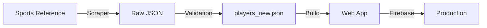

# BallKnower - Sports Knowledge Game
[ballknower.co](https://ballknower.co)

> Connect NBA and NFL players through teams, numbers, and colleges

## Repository Structure

This monorepo contains two main components:

### 🎮 `/ballknower` - Web Application
The main React application for playing BallKnower.

### 🕷️ `/scraper` - Data Collection Pipeline
Python scripts for scraping and maintaining the player database from Sports Reference websites.

## Project Overview

**BallKnower** is a web-based trivia game where players connect athletes through shared attributes:
- 👕 Jersey Numbers
- 🏟️ Teams
- 🎓 Colleges
- 👤 Players

### Game Modes
- **Daily Challenge**: Daily puzzle with optimal solution scoring
- **Online Multiplayer**: Real-time competitive play

### Key Features
- 10,000+ NBA and NFL players
- Smart autocomplete search
- ELO rating system
- Global leaderboards
- Responsive design (mobile-first)
- Real-time analytics

## Data Pipeline



1. **Scraper** collects data from Sports Reference sites
2. **Validation** normalizes and validates player data
3. **Build** includes data in production bundle
4. **Deploy** to Firebase Hosting

## Architecture

```
ball-knower/
├── ballknower/           # React web application
│   ├── public/
│   │   └── backend/      # Static player data
│   ├── src/
│   │   ├── components/   # React components
│   │   ├── pages/        # Route pages
│   │   ├── context/      # State management
│   │   ├── services/     # API services
│   │   └── utils/        # Utilities
│   ├── dailyAutomater/   # Daily challenge generator
│   ├── .env.example      # Environment template
│   ├── firebase.json     # Firebase config
│   └── package.json
│
└── scraper/              # Python data scraper
    ├── archive/          # Legacy scripts
    ├── config.py         # Scraper configuration
    ├── utils.py          # HTTP utilities
    ├── fetch_*.py        # Scraper modules
    ├── run_scraper.py    # Main orchestrator
    └── README.md
```

**Documentation**: See README files in each subdirectory for detailed docs

